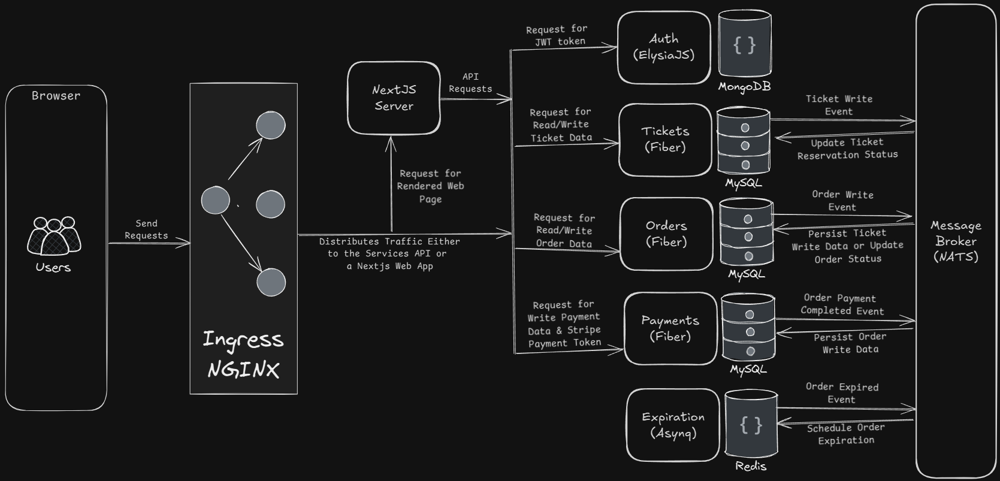

# Ticketing e-Commerce Microservices
This repository showcases an example of a polyglot microservices monorepo. The premise of the application itself is simple, is to provide a peer-to-peer based e-commerce platform for selling and buying tickets, similar to StubHub.

## System Overview


## Services
The application architecture consists of the following components:

### Frontend
- **Stack**: Next.js
- **Purpose**: Provides a user-friendly interface for buyers and sellers to interact with the ticketing system.
- **Features**: 
  - Rendered web pages for ticket listings, orders, and payments.
  - Internally interacts with backend services via REST APIs.

### Ingress (NGINX)
- **Purpose**: Acts as the traffic router for incoming requests.
- **Features**: 
  - Distributes traffic between the Next.js frontend and the backend services.
  - Enables secure and efficient request routing.

### Auth Service
- **Stack**: ElysiaJS (Bun) with MongoDB.
- **Purpose**: Handles user JWT authentication and authorization.
- **Reasoning**: 
  - MongoDB's schema-less nature is ideal for dynamic user data.
  - JWT tokens provide scalable and stateless authentication.

### Tickets Service
- **Stack**: Fiber (Go) with MySQL.
- **Purpose**: Manages ticket data (creation, updates, and reservations).
- **Reasoning**: 
  - Fiber's speed and lightweight design make it suitable for handling high request loads.
  - MySQL's relational model ensures consistency for ticket-related transactions.

### Orders Service
- **Stack**: Fiber (Go) with MySQL.
- **Purpose**: Handles order creation, updating, management.
- **Reasoning**: 
  - Fiber's performance optimizes order processing.
  - MySQL provides transactional guarantees for order integrity.

### Payments Service
- **Stack**: Fiber (Go) with MySQL.
- **Purpose**: Manages payment data and handle Stripe payment integration.
- **Reasoning**: 
  - The lightweight Fiber ensures quick response times.
  - MySQL ensures persistence and consistency of payment records.

### Expiration Service
- **Stack**: Asynq (Go) with Redis.
- **Purpose**: Handles order expiration events and schedules tasks.
- **Reasoning**: 
  - Redis is well-suited for time-sensitive operations and task scheduling.
  - Asynq provides an efficient task queue for managing delayed jobs.

### Message Broker
- **Stack**: NATS
- **Purpose**: Facilitates communication between microservices using events.
- **Reasoning**: 
  - Enables asynchronous and decoupled communication.
  - Ensures scalability and fault tolerance.

## Future Enhancements
- Add more robust monitoring (e.g. Prometheus and Grafana).
- Add tracing and logging capabilities.
- Extend test coverage to include more scenarios.
- Implement Optimistic Concurrency Control (OCC) for data consistency.

## Local Setup

### Prerequisites
- Docker
- Minikube (or another Kubernetes cluster)
- Kubernetes CLI
- Skaffold

### Start Local Kubernetes Cluster (e.g. Minikube)
```bash
minikube start
```
### Enable Ingress addon (For Minikube)
```bash
minikube addons enable ingress
```
### Tunnel Ingress traffic to localhost (For Minikube)
```bash
minikube tunnel
```
### Configure `/etc/hosts` file
```bash
127.0.0.1 ticketing.dev
```
### Clone the repository
```bash
git clone https://github.com/givxl33t/ticketing-ecommerce-microservices.git
```
### Start the application
```bash
cd ticketing-ecommerce-microservices
skaffold start
```
Note: The application will be available at `http://ticketing.dev` only after the application is started. To bypass untrusted kubernetes certificates, you can just type `thisisunsafe` on the browser.